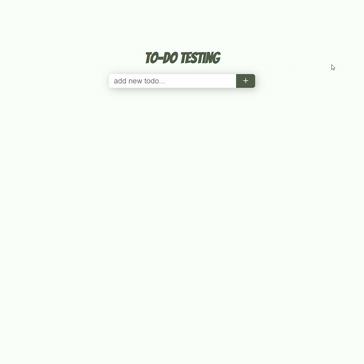

# :evergreen_tree: Cypress Testing Training

> ### *“All code is guilty, until proven innocent.”* – Anonymous
<br>

## :eyes: Overview
It is always safer to test our code than to simply assume that everything is working. The price of shipping faulty software is too big compared to the investment of time that testing requires. However, this investment don't need to be greater than necessary. Automated testing is a reliable and efficient way to optimize our time as developers and guarantee that we are always shipping working code to our clients.

In this training, you will learn the first steps of setting up the E2E testing tool [Cypress](https://www.cypress.io/) in your front-end applications. By the end of this session you should feel comfortable installing and working with basic Cypress functionalities, writing simple test cases, and running tests tests on your application.

**Here are a few resources to help get you started:**
 - [Introduction to Cypress](https://docs.cypress.io/guides/core-concepts/introduction-to-cypress.html#Cypress-Can-Be-Simple-Sometimes)
 - [Cypress in a Nutshell](https://www.youtube.com/watch?reload=9&v=LcGHiFnBh3Y)
 - [How to Test Your Frontend with the Cypress.io Framework](https://medium.com/free-code-camp/how-to-test-your-frontend-with-the-cypress-io-framework-f048070f4330)
 - [Testing Tips](./assets/testing-tips.md)

This repository contains a simple to-do web application developed with ReactJS that you will use to run your tests against. The principles of what you will learn should work with any front-end frameworks.

 ## :world_map: Instructions

During the training I will walk you through setting up Cypress and writing your first test cases. If you get lost, please refer to this section. All information you need will be found here.

### **Setting up project repository**.

Fork this repository so you can have a copy saved to your GitHub that you can work on. Please, do not sync your fork with this repository. If you do not know how to fork GitHub repositories, check this page: [Fork a repo](https://docs.github.com/en/free-pro-team@latest/github/getting-started-with-github/fork-a-repo).

Clone your fork to your local machine. For the purposes of this training, I advise you to clone your project into a windows directory and not into a WSL directory (if you use WSL at all). Unfortunately, WSL only supports cypress headless mode. There are a few workarounds to make the cypress UI work in WSL that will not be covered in this training.

After you sucessfully cloned your forked repository run: `npm i` or `yarn` (this project uses yarn, but running an npm command should work just fine).

### **Installing and setting up Cypress**

To start the application all you need to do is run `npm start` or `yarn start`. It then will available locally at `http://localhost:3000`. It should look something like this:



Now that our app is working, let's focus in setting up cypress. Run `npm i cypress -D` or `yarn add -D cypress`.

Cypress is now installed. Now, add these scripts to `package.json`: `"cypress": "cypress open"` and `"cy:test": "cypress run"`. These scripts will make our lives easier when we need to open the Cypress UI or execute tests in headless mode.

After adding the scripts, run `npm run cypress` or `yarn cypress`. There will be a small setup that cypress will arrange for you automatically. After the setup is done you should see a cypress window opened, a new file, and a new folder in your project. You new project structure will be:

```
/
  ...
  cypress/
    fixtures/
      example.json/
    integration/
      examples/
    plugins/
      index.js
    support/
      commands.js
      index.js
  ...
  cypress.json
  ...  
```

Cypress add a bunch of example files to help you get started and learn about the purpose of each folder and file. In summary:

- **cypress/** : All files related to cypress and its set up will go inside this folder. Think of it as your "tests" folder.
- **cypress/fixtures** : Here you will put all files that represent "dummy data" that you will stub out for your front-end. These are written in JSON, and are great way to stub informationt that will be used to fill a form, for example.
- **cypress/integration** : This is where your test cases will go. In cypress tests are called specs, and each spec can contain several test cases.
- **cypress/plugins** : There are hundreds of plugins that you can install to work with cypress. When you add these plugins to your project you will set up them in files that are kept here.
- **cypress/support** : Any custom commands or simple abstractions can be written in the `commands.js` files that lives inside the support folder.
- **cypress.json** : This is cypress default custom configurations file, at first it is empty but over time we can fill it with important settings that will tune our test suite to our needs. Things like environment variables, security settings, timeout, etc, are defined here.

I also suggest you to explore some of the example spec files. They can give you really good insight on how to write test cases.

As you write and run your tests other folders and files will be added to the `cypress/` folder. More specifically, the `cypress/screenshots` and `cypress/videos` folders.

When you are ready, go ahead and delete the `cypress/integration/examples` folder and the `cypress/fixtures/example.json` file. We want to have a clean structure for our project.

Now, add the following lines to your `cypress.json` file:
```json
{
  "baseUrl": "http://localhost:3000",
  "viewportHeight": 1000
}
```

You can learn more about the config options here: [Configuration](https://docs.cypress.io/guides/references/configuration.html#Options).

With this the setup for this simple test suite, is done. Now we are ready to start writing our test cases.

### **Writing test cases**